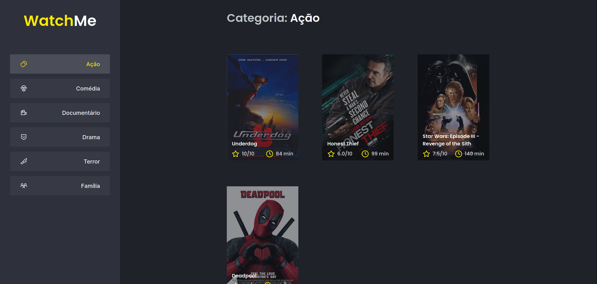

  
  
      

 

  

<h3 align="center">
  Desafio 02 - Trilha ReactJS
</h2>

	Resolução do Desafio "Componentizando a Aplicação"

## Sobre o desafio

  

Nesse desafio, você deverá criar uma aplicação para treinar o que aprendeu até agora no ReactJS

Essa será uma aplicação onde o seu principal objetivo é refatorar uma página para listagem de filmes de acordo com gênero. 

A aplicação já está totalmente funcional mas grande parte do seu código está diretamente no arquivo `App.tsx`. Para resolver isso da melhor forma, é necessário dividir a aplicação em **pelo menos** duas partes principais: sidebar e o conteúdo principal que possui o header e a listagem de filmes.

- A aplicação possui apenas uma funcionalidade principal que é a listagem de filmes;
- Na sidebar é possível selecionar qual categoria de filmes deve ser listada;
- A primeira categoria da lista (que é "Ação") já deve começar como marcada;
- O header da aplicação possui apenas o nome da categoria selecionada que deve mudar dinamicamente.

## Status do desafio

✅ Completo